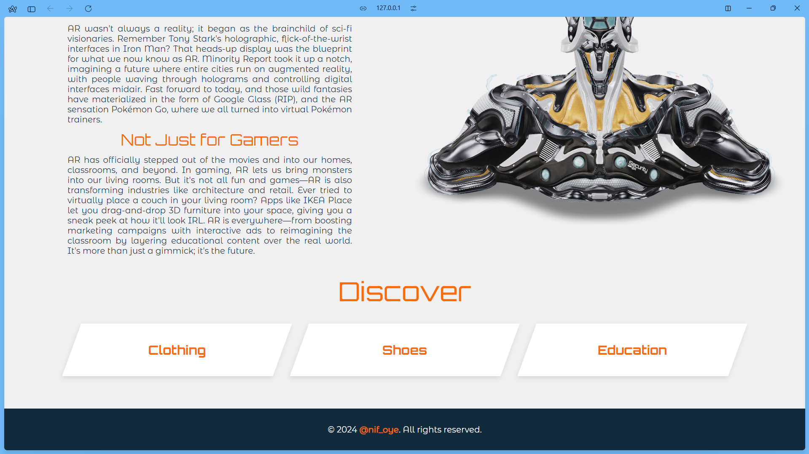
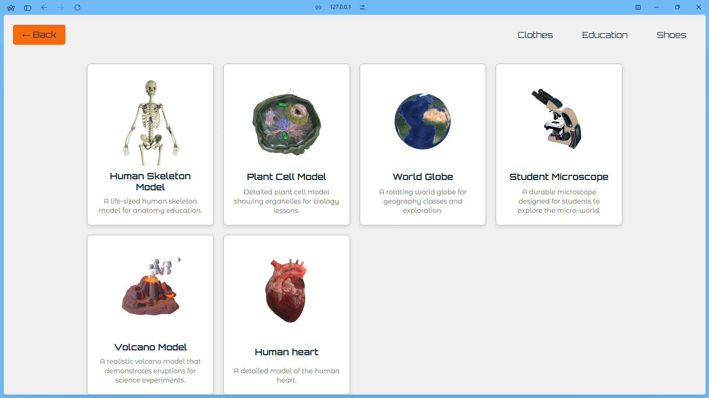
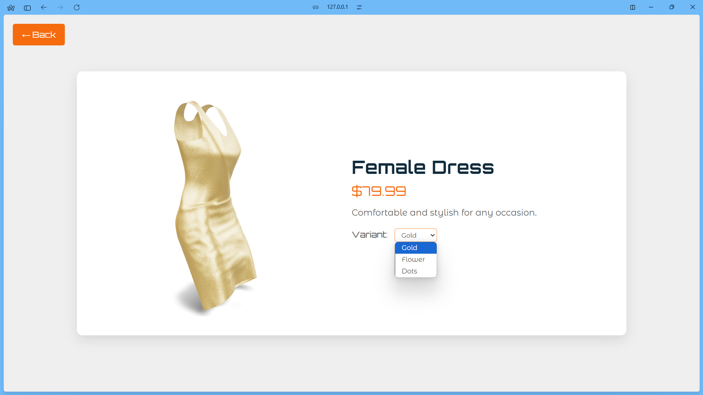
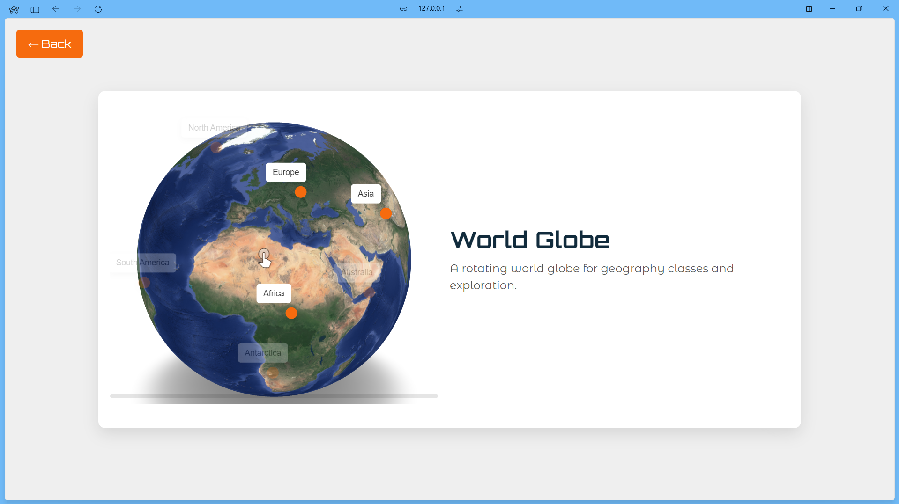

# AR-Zenith
 
AR Zenith is an immersive e-commerce/exhibition platform that leverages augmented reality to enhance product browsing. Users can interact with 3D models, view detailed annotations, and customize product materials in real-time. The platform supports various product categories, providing a dynamic and engaging shopping experience. Built with model-viewer, AR Zenith showcases the potential of AR in online retail, offering seamless integration of annotations and material variant switching.

---

### Screen Captures
1. AR Zenith Home Page

2. Education Category Page

3. A product with variant materials

4. A product with annotations

